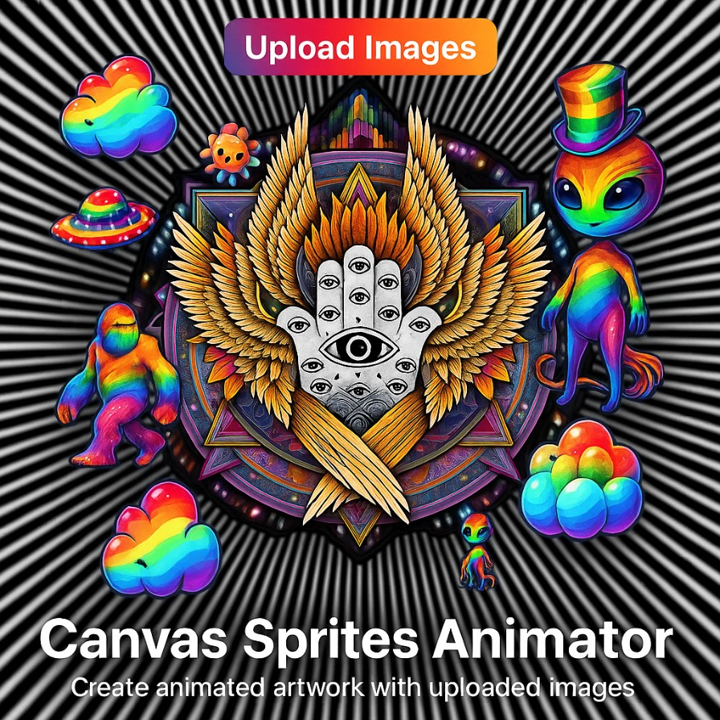
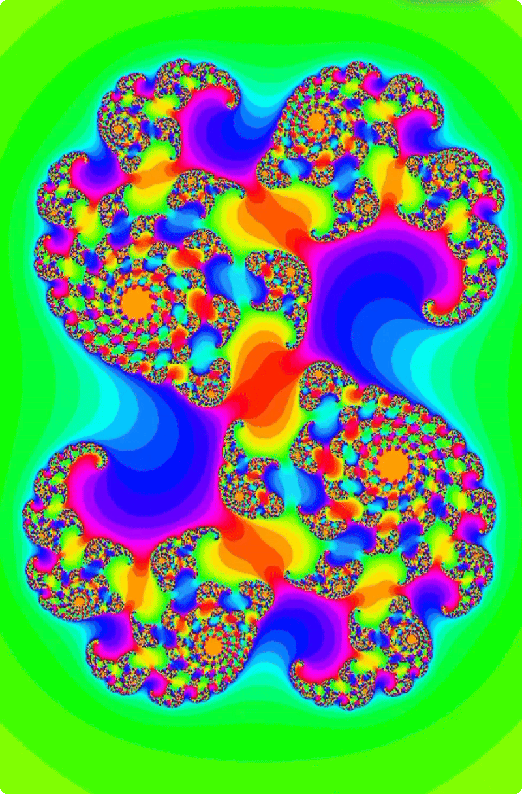

# 🎨 Canvas Sprites Animator

## 📌 Overview

Canvas Sprites Animator is an interactive web-based application that allows users to upload images, arrange and transform them on a canvas, apply effects, and export the results as **GIF animations** or **transparent PNGs**. Users can control rotation, scaling, layering, and other parameters with mouse or touch gestures.

This project is part of Food4Thoth, a digital creative space blending art, mysticism, and technology.

---

# 🚀 Features
- 🖼️ **Image Upload**: Add sprites, illustrations, or character assets from your device.
- 🔄 **Transform Controls**: Rotate, scale, and reorder layers.
- 🖌️ **Interactive Placement**: Click, drag, and use touch gestures to position elements.
- 🎨 **Effects & Filters**: Apply custom FX for unique results.
- 📐 **Canvas Customization**: Adjust resolution, aspect ratio, and symmetry options.
- 💾 **Save to Gallery**: Store individual frames locally in the built-in gallery.
- 🎞️ **GIF Export**: Combine frames into animated GIFs with adjustable speed, quality, and size.
- 🌈 **Cyberpunk-Inspired UI**: Vibrant neon buttons and animated gradients.
- 🌗 **Dark Mode**: Toggle between light and dark themes.

---

# 🔧 How It Works

## 1️⃣ Upload & Placement
- Select **Upload Images** to add assets to the canvas.
- Drag and drop sprites or use touch gestures on mobile devices.

## 2️⃣ Transform & Customize
- Use sliders to adjust rotation and scaling.
- Reorder layers with **Bring Forward** and **Send Backward** buttons.
- Customize canvas dimensions and background settings.

## 3️⃣ Save & Export
- Save individual frames to the gallery.
- Export your collection as a GIF with control over frame delay, resolution, and quality.
- Download transparent PNGs for static artwork.

---

# 📂 Project Structure

/DrawingGifs  
│── index.html          # Main HTML structure  
│── styles.css          # Cyberpunk-themed styling  
│── script.js           # Main animation and export logic  
│── nav_script.js       # Navigation controls  
│── lib/gif.js          # GIF creation library  
│── lib/gif.worker.js   # Worker script for GIF processing  
│── README.md           # This file  

---

# 📜 Dependencies

This project uses:
- **JavaScript Canvas API** – For rendering and manipulation.
- **GIF.js** – For generating animated GIFs (lib/gif.js, lib/gif.worker.js).
- **CSS3 Animations** – For neon cyberpunk UI effects.

---

# 🎨 Customization

Modify **styles.css** to change colors, gradients, and button animations.  
Add or tweak animation behaviors in **script.js**.

---

# 💡 Philosophy & Vision

This project aligns with the Food4Thoth initiative:
- **Creativity** – Empowering users to create original animated artworks.
- **Exploration** – Encouraging experimentation with visual composition and movement.
- **Community** – Offering tools for artists to share and collaborate.

---

# 🌍 Connect & Support

If you enjoy this project, consider supporting Food4Thoth:

---

## From Drawing With Fractals App

- 🌟 [FOOD4THOTH Draw with Fractals](https://www.food4thoth.com/DrawingFractals/index.html)

---

# 🌌 Philosophy and Vision

Food4Thoth is inspired by the principles of its namesake, Thoth:
- **Creativity**: A celebration of art, imagination, and innovation.
- **Exploration**: Encouraging curiosity and the pursuit of knowledge.
- **Community Building**: Connecting individuals through shared resources and mutual support.
- **Playfulness**: Balancing deep inquiry with interactive and fun experiences.

The platform is a digital garden where ancient wisdom meets modern innovation.

---

# ✨ Why Visit Food4Thoth?

1. **Diverse Offerings**: Content that caters to various interests, from art and mysticism to community activism.
2. **Interactive Tools**: Explore engaging applications like calculators, games, and divination apps.
3. **Community Engagement**: Opportunities for collaboration and connection through artistic and social projects.
4. **Inspiration**: A space to spark curiosity, reflection, and joy.

---

## 🤝 Support and Contributions

Your contributions help support innovative projects like the Rainbow Glo-Calculato, community gardens, and esoteric tools, ensuring **Food4Thoth** continues to thrive.

### Donation Options

#### Traditional Payments:
1. [PayPal](https://paypal.me/artabillies)
2. [Venmo](https://venmo.com/u/DeJahnvu)

#### Cryptocurrency:
- **Ethereum (ETH) & ERC-20 Tokens**:  
  
0x900e8f0d397048fD946b05553DeD5Ed3D5e4f1a0
  
  

- **Bitcoin (BTC)**:  
  
bc1qcsa7ffef296pp9hkrn03p9wu7lt0fm3s2sz0wp
  
  

- **Ethereum Classic (ETC)**:  
  
0xEb3C0e08868ACB0f515442579333c41E7a34F215

- **Solana (SOL)**:  
   
B7nCFQs6HkFAvkz1wEUiPpM4Cj7G6FJNYQ7Avrt6a4cm
 
  

- **Ripple (XRP)**:  
  Address:  
rEAKseZ7yNgaDuxH74PkqB12cVWohpi7R6
 
  Memo: `3109966062`  
  

- **Dogecoin (DOGE)**:  
  
DP2e6J8NbUzswLtBw8ou2xYz4BinyzgU7n
  
  

- **Cardano (ADA)**:  
  
addr1qxqgjp4h4vh4pxrg7jur8m96lzf5w98cahfflrw376qhufgg6h5us0avc20ee2azzun58lgylyl54sjr6y9efwq86krs3ladtw
  
  

- **Bitcoin Cash (BCH)**:  
   
bitcoincash:qpu93py8j8ykcf7m6tmau2hldefl67t9lydw8afsa5
 
 

- **Stellar Lumens (XLM)**:  
  Address:  
GB2ES2N326MZK4EGJBKN3ZARCQ5RTFQSAWIJAAKFVIIIJSCC35TXIMLB

  Memo: `2967141893`  
 

- **Litecoin (LTC)**:  
   
ltc1qklestxa5shsym0gmuqmv2xewp56cst58vmhggl

- **Tezos (XTZ)**:  
   
tz1guFykj1dQAyiGH7g5YJVZzaGdoTWeMK81
  
 

---

## 💡 Wallets
1. **Coinbase Wallet**:  
  
0x30D47A5815D94040291a819B8E39765AA09d44A8
 
   

2. **Metamask Wallet**:  
   
0x30D47A5815D94040291a819B8E39765AA09d44A8

3. **VeWorld Wallet**:  
    
0x020a79559990145e2f7d48c5771b233399b30bee
 
   

4. **Anchor Wallet**:  
   `artabilly.gm`

---

## 🔗 Explore the Food4Thoth Hub

Visit the **Food4Thoth** portal and begin your journey through creativity, mysticism, and connection.

- 🌟 [FOOD4THOTH Website](../index.html)
- 🌟 [FOOD4THOTH Instagram](https://www.instagram.com/emerald_path_food4th0th/profilecard/?igsh=dTJnejRlczhqNjho)
- 🌟 [FOOD4THOTH Facebook](https://www.facebook.com/share/W8VnfAM2NHBAMTUb/?mibextid=JRoKGi)
- 🌟 [Learn About ARTABILLIES](../Artabillies/index.html)
- 🌟 [ARTABILLIES Website](http://www.artabillies.com)
- 🌟 [ARTABILLIES Instagram](https://www.instagram.com/artabillies/profilecard/?igsh=MW1zbGg2Y2Z1a3FhdQ==)
- 🌟 [ARTABILLIES Facebook](https://www.facebook.com/share/sEUxePbaAo9kyRNN/?mibextid=JRoKGi)
- 🌟 [ARTABILLIES Facebook Group](https://www.facebook.com/share/g/6N5MX3W8pS3dbQuD/?mibextid=K35XfP)
- 🌟 [Rstory, FOOD4THOTH & ARTABILLIES](../RstoryArtabillies/index.html)
- 🌟 [Donations Page](../Donations/index.html)

---

## 💌 Contact

For inquiries or feedback:
- **Email**: [food4thoth@proton.me](mailto:food4thoth@proton.me)

---

## 🎉 Acknowledgments

Food4Thoth represents the collective effort of artists, mystics, and community builders. Thank you to all contributors and supporters who make this digital garden flourish.

Join us and explore the endless possibilities of **Food4Thoth**!

---

⚡ **Credits**  
Designed, coded, and curated by DeJahn under Artabillies & FOOD4THOTH.  

---

📝 **License**  
© 2025 Food4Thoth. All rights reserved.  
Unauthorized redistribution, copying, or modification without explicit permission is prohibited.  

🎨 Happy animating! 🚀✨