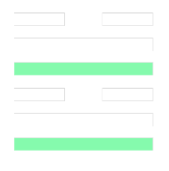

    <button class="nav-button" onclick="location.href='../TarotLanding/index.html'">Tarot Orientation Landing</button>
    <button class="nav-button" onclick="location.href='../TarotLanding/HowTo.html'">How To: Tarot – FOOD4THOTH</button>
    <button class="nav-button" onclick="location.href='../TarotFlipCardGallery/index.html'">Quick Reference Flip Gallery</button>
    <button class="nav-button" onclick="location.href='../TarotTogetherNoAge/index.html'">Tarot Card Gallery (3 Decks)</button>
    <button class="nav-button" onclick="location.href='../TarotTogetherNoAge4Decks/index.html'">Tarot Card Gallery (4 Decks)</button>
    <button class="nav-button" onclick="location.href='../CelticCrossTarot/index.html'">Celtic Cross Reading</button>
    <button class="nav-button" onclick="location.href='../ThreeCardTarot/index.html'">Three-Card Tarot w/ Gallery</button>
    <button class="nav-button" onclick="location.href='../ThreeCardTarotByItself/index.html'">Three-Card Tarot Reading</button>
    <button class="nav-button" onclick="location.href='../TarotSacredGeometry/index.html'">Sacred Geometry Tarot</button>
    <button class="nav-button" onclick="location.href='../TarotCyberPunkDark/index.html'">CyberPunk Dark Tarot</button>
    <button class="nav-button" onclick="location.href='../TarotCyberPunkMelo/index.html'">CyberPunk Melo Tarot</button>
    <button class="nav-button" onclick="location.href='../TarotOG/index.html'">OG Tarot w/ Voice Commands</button>
    <button class="nav-button" onclick="location.href='../EgyptianTarot/index.html'">Custom Egyptian Major Arcana (1–22)</button>
    <button class="nav-button" onclick="location.href='../EgyptianTarotFull/index.html'">Custom Sacred Geometry (1–78)</button>
    <button class="nav-button" onclick="location.href='../TarotJungian/index.html'">Jungian Thoth Tarot Spread</button>
    <button class="nav-button" onclick="location.href='../TarotTextList/index.html'">Cyberpunk Tarot Text Library</button>
    <button class="nav-button" onclick="location.href='../DrawTarot/index.html'">All Spreads</button>
    <button class="nav-button" onclick="location.href='../MajixLanding/index.html'">Majix Galleries Landing</button>
    <button class="nav-button" onclick="location.href='../MajixTarotMajor/index.html'">Major Arcana</button>
    <button class="nav-button" onclick="location.href='../MajixTarotWands/index.html'">Wands</button>
    <button class="nav-button" onclick="location.href='../MajixTarotCups/index.html'">Cups</button>
    <button class="nav-button" onclick="location.href='../MajixTarotSwords/index.html'">Swords</button>
    <button class="nav-button" onclick="location.href='../MajixTarotPentacles/index.html'">Pentacles</button>
    <button class="nav-button" onclick="location.href='../MajixTarotAll/index.html'">All Cards</button>
    <button class="nav-button" onclick="location.href='../TarotGalleries/index.html'">Explore All Galleries</button>
    <button class="nav-button" onclick="location.href='../TarotCrystalQueens/indexAge.html'">18+ Crystal Queens Tarot</button>
    <button class="nav-button" onclick="location.href='../TarotCyberPunkX/indexAge.html'">18+ CyberPunk X Tarot</button>
    <button class="nav-button" onclick="location.href='../TarotAgeVerify/index.html'">FOOD4THOTH 18+ Tarot Gallery</button>
    <button class="nav-button" onclick="location.href='../TarotAllResources/index.html'">All Resources</button>
    <button class="nav-button" onclick="location.href='../comingSoon.html'">More Tarot Coming Soon</button>
    <button class="nav-button" onclick="location.href='../parental-controls.html'">Parental Controls</button>
		<button class="nav-button" onclick="location.href='../Iching/index.html'">I Ching</button>
    <button class="nav-button" onclick="location.href='../IchingFractal/index.html'">I Ching Fractal</button>
    <button class="nav-button" onclick="location.href='../IchingPhoto/index.html'">I Ching Fractal/Photo</button>

# 🧿 I Ching Divination App

The **I Ching Divination App** brings the wisdom of the ancient Chinese divination system into the digital age. This interactive application offers users an intuitive, modern way to explore the 64 hexagrams, receive insights, and reflect on their personal journeys—all while honoring the deep philosophical and spiritual roots of the I Ching.

---

## 🌟 Overview

The I Ching App provides two main interaction modes:
1. **Automatic Mode**: Generates a hexagram using a virtual coin toss simulation.
2. **Manual Mode**: Allows users to input each line (solid or broken) for a custom hexagram experience.

Once the hexagram is generated, users receive:
- A **primary hexagram** with detailed interpretations.
- **Changing lines** that represent transitions or transformations.
- A **resulting hexagram** that highlights potential outcomes.

The app also offers dynamic animations, dark mode support, and local storage to save and revisit readings, making the experience seamless and engaging for users across all devices.

---

## 🌐 Features

### **Hexagram Generation**
- **Coin Toss Simulation**: Automatically generates hexagrams following traditional I Ching methods.
- **Manual Input**: Users can choose each line (solid, broken, changing) for a more personalized divination experience.

### **Interpretations and Insights**
- **Comprehensive Explanations**:
  - Includes detailed meanings for all 64 hexagrams and their changing lines.
  - Offers philosophical guidance based on the I Ching’s core principles.
- **Dynamic Display**:
  - Hexagrams are rendered interactively with smooth transitions and animations.

### **User Experience Features**
- **Dark Mode**: Toggle between light and dark themes for comfortable viewing.
- **Save and Load Readings**:
  - Local storage integration allows users to save their readings for future reference.
  - Clear saved data easily when needed.
- **Interactive Animations**:
  - Visual hexagram animations using SVGs enhance engagement.
  - Fluid transitions create a polished, modern feel.

### **Accessibility**
- **Text-to-Speech (TTS)**:
  - Reads out hexagram interpretations for users with visual impairments.
- **Responsive Design**:
  - Optimized for desktops, tablets, and mobile devices.

---

## 🚀 How to Use

### **1. Launch the App**
- Open the app in your browser or on your mobile device.

### **2. Choose a Mode**
- **Automatic Mode**: Click “Generate Hexagram” to begin a virtual coin toss and receive your hexagram.
- **Manual Mode**: Manually input each line type (solid, broken, changing) to customize your hexagram.

### **3. View Your Reading**
- The app displays your primary hexagram, any changing lines, and the resulting hexagram.
- Explore detailed interpretations for each element of your reading.

### **4. Save Your Reading (Optional)**
- Save your hexagram to local storage for future reflection or revisitation.

### **5. Customize Your Experience**
- Toggle between light and dark modes for your viewing preference.
- Replay animations or generate a new reading as desired.

---

## 🛠️ Technologies Used

- **Frontend**:
  - **HTML5** for structure.
  - **CSS3** for styling, including dark mode and neumorphic elements.
  - **JavaScript (ES6)** for functionality, including hexagram generation and animations.
- **Animations**:
  - Smooth transitions powered by CSS and JavaScript.
  - Dynamic SVG and PNG rendering for hexagrams.
- **Local Storage**:
  - Saves and loads user readings to provide a personalized experience.
- **Accessibility**:
  - Text-to-Speech API integration.

---

## 🗂️ File Structure

/Root      
│── **Iching/**      
│   ├── hexagrams.json      
│   ├── hexscript.js      
│   ├── ichingAnime.html      
│   ├── ichingAnimeLoop.html      
│   ├── images/      
│   ├── index.html      
│   ├── info/      
│   ├── nav_script.js      
│   ├── README.md      
│   ├── styles.css      
│   ├── styles1.css      
│   ├── styles2.css      

│── **IchingFractal/**      
│   ├── hexagrams.json      
│   ├── hexscript.js      
│   ├── ichingAnime.html      
│   ├── images/      
│   ├── index.html      
│   ├── info/      
│   ├── lib/      
│   ├── nav_script.js      
│   ├── README.md      
│   ├── styles.css      
│   ├── styles1.css      

│── **IchingPhoto/**      
│   ├── hexagrams.json      
│   ├── hexscript.js      
│   ├── ichingAnime.html      
│   ├── images/      
│   ├── index.html      
│   ├── info/      
│   ├── lib/      
│   ├── nav_script.js      
│   ├── README.md      
│   ├── styles.css      
│   ├── styles1.css      

---

#           I Ching Animation

---

## 📌 Future Enhancements

- **Cloud Storage**:
  - Allow users to save readings to the cloud for cross-device access.
- **Personalization**:
  - Offer customizable hexagram appearances and animations.
- **Community Features**:
  - Add a social sharing option for users to share their readings with friends.
- **Mobile App**:
  - Develop a standalone app for Android and iOS.
- **Expanded Language Support**:
  - Add multiple languages for global accessibility.
- **Advanced Features**:
  - Include guides for combining hexagrams into complex readings.

---

## 🤝 Credits and Acknowledgments

This app was inspired by the traditional **I Ching divination system** and the [aiching.app](https://aiching.app/how-to-consult-the-i-ching/) platform. It serves as a digital counterpart to the book [*Embracing Life's Journey: Your Guide to Personal Growth with the I Ching*](https://www.amazon.com/dp/B0C9SFNR4P). Special thanks to the creators of the [I Ching Divination Script](https://github.com/jamesgodwin/I-Ching-Divination-Script) for their contributions to the community.

This project is part of the **Food4Thoth Initiative**, inspired by ancient wisdom and brought to life through modern technology.

---

## 🌌 Philosophy and Vision

Food4Thoth is inspired by the principles of its namesake, Thoth:
- **Creativity**: A celebration of art, imagination, and innovation.
- **Exploration**: Encouraging curiosity and the pursuit of knowledge.
- **Community Building**: Connecting individuals through shared resources and mutual support.
- **Playfulness**: Balancing deep inquiry with interactive and fun experiences.

The platform is a digital garden where ancient wisdom meets modern innovation.

---

## ✨ Why Visit Food4Thoth?

1. **Diverse Offerings**: Content that caters to various interests, from art and mysticism to community activism.
2. **Interactive Tools**: Explore engaging applications like calculators, games, and divination apps.
3. **Community Engagement**: Opportunities for collaboration and connection through artistic and social projects.
4. **Inspiration**: A space to spark curiosity, reflection, and joy.

---

## 🤝 Support and Contributions

Your contributions help support innovative projects like the Rainbow Glo-Calculato, community gardens, and esoteric tools, ensuring **Food4Thoth** continues to thrive.

### Donation Options

#### Traditional Payments:
1. [PayPal](https://paypal.me/artabillies)
2. [Venmo](https://venmo.com/u/DeJahnvu)

#### Cryptocurrency:
- **Ethereum (ETH) & ERC-20 Tokens**:  
  
0x900e8f0d397048fD946b05553DeD5Ed3D5e4f1a0
  
  

- **Bitcoin (BTC)**:  
  
bc1qcsa7ffef296pp9hkrn03p9wu7lt0fm3s2sz0wp
  
  

- **Ethereum Classic (ETC)**:  
  
0xEb3C0e08868ACB0f515442579333c41E7a34F215

- **Solana (SOL)**:  
   
B7nCFQs6HkFAvkz1wEUiPpM4Cj7G6FJNYQ7Avrt6a4cm
 
  

- **Ripple (XRP)**:  
  Address:  
rEAKseZ7yNgaDuxH74PkqB12cVWohpi7R6
 
  Memo: `3109966062`  
  

- **Dogecoin (DOGE)**:  
  
DP2e6J8NbUzswLtBw8ou2xYz4BinyzgU7n
  
  

- **Cardano (ADA)**:  
  
addr1qxqgjp4h4vh4pxrg7jur8m96lzf5w98cahfflrw376qhufgg6h5us0avc20ee2azzun58lgylyl54sjr6y9efwq86krs3ladtw
  
  

- **Bitcoin Cash (BCH)**:  
   
bitcoincash:qpu93py8j8ykcf7m6tmau2hldefl67t9lydw8afsa5
 
 

- **Stellar Lumens (XLM)**:  
  Address:  
GB2ES2N326MZK4EGJBKN3ZARCQ5RTFQSAWIJAAKFVIIIJSCC35TXIMLB

  Memo: `2967141893`  
 

- **Litecoin (LTC)**:  
   
ltc1qklestxa5shsym0gmuqmv2xewp56cst58vmhggl

- **Tezos (XTZ)**:  
   
tz1guFykj1dQAyiGH7g5YJVZzaGdoTWeMK81
  
 

---

## 💡 Wallets
1. **Coinbase Wallet**:  
  
0x30D47A5815D94040291a819B8E39765AA09d44A8
 
   

2. **Metamask Wallet**:  
   
0x30D47A5815D94040291a819B8E39765AA09d44A8

3. **VeWorld Wallet**:  
    
0x020a79559990145e2f7d48c5771b233399b30bee
 
   

4. **Anchor Wallet**:  
   `artabilly.gm`

---

## 🤝 Contribution Guidelines

We welcome contributions to enhance this project:
1. Fork the repository.
2. Create a feature branch: `git checkout -b feature-name`.
3. Commit your changes: `git commit -m "Add feature or fix"`.
4. Push your branch: `git push origin feature-name`.
5. Submit a pull request for review.

---

## 🔗 Explore the Food4Thoth Hub

Visit the **Food4Thoth** portal and begin your journey through creativity, mysticism, and connection.

- 🌟 [FOOD4THOTH Website](../index.html)
- 🌟 [FOOD4THOTH Instagram](https://www.instagram.com/emerald_path_food4th0th/profilecard/?igsh=dTJnejRlczhqNjho)
- 🌟 [FOOD4THOTH Facebook](https://www.facebook.com/share/W8VnfAM2NHBAMTUb/?mibextid=JRoKGi)
- 🌟 [Learn About ARTABILLIES](../Artabillies/index.html)
- 🌟 [ARTABILLIES Website](http://www.artabillies.com)
- 🌟 [ARTABILLIES Instagram](https://www.instagram.com/artabillies/profilecard/?igsh=MW1zbGg2Y2Z1a3FhdQ==)
- 🌟 [ARTABILLIES Facebook](https://www.facebook.com/share/sEUxePbaAo9kyRNN/?mibextid=JRoKGi)
- 🌟 [ARTABILLIES Facebook Group](https://www.facebook.com/share/g/6N5MX3W8pS3dbQuD/?mibextid=K35XfP)
- 🌟 [Rstory, FOOD4THOTH & ARTABILLIES](../RstoryArtabillies/index.html)
- 🌟 [Donations Page](../Donations/index.html)

---

## 💌 Contact

For inquiries or feedback:
- **Email**: [food4thoth@proton.me](mailto:food4thoth@proton.me)

---

# 🔮 Tarot Navigation

### 📖 Tarot Learning & Orientation  
[Tarot Orientation Landing](../TarotLanding/index.html)  
[How To: Tarot – FOOD4THOTH](../TarotLanding/HowTo.html)  
[Quick Reference Flip Gallery](../TarotFlipCardGallery/index.html)  

### 🎴 General Tarot Decks & Readings  
[Tarot Card Gallery (3 Decks)](../TarotTogetherNoAge/index.html)  
[Tarot Card Gallery (4 Decks)](../TarotTogetherNoAge4Decks/index.html)  
[Celtic Cross Reading](../CelticCrossTarot/index.html)  
[Three-Card Tarot w/ Gallery](../ThreeCardTarot/index.html)  
[Three-Card Tarot Reading](../ThreeCardTarotByItself/index.html)  

### 🌌 Cyberpunk & Thematic Tarot Decks  
[Sacred Geometry Tarot](../TarotSacredGeometry/index.html)  
[CyberPunk Dark Tarot](../TarotCyberPunkDark/index.html)  
[CyberPunk Melo Tarot](../TarotCyberPunkMelo/index.html)  
[OG Tarot w/ Voice Commands](../TarotOG/index.html)  

### 🏺 Experimental & Custom Decks  
[Custom Egyptian Major Arcana (1–22)](../EgyptianTarot/index.html)  
[Custom Sacred Geometry (1–78)](../EgyptianTarotFull/index.html)  
[Jungian Thoth Tarot Spread](../TarotJungian/index.html)  
[Cyberpunk Tarot Text Library](../TarotTextList/index.html)  
[All Spreads](../DrawTarot/index.html)  

### 🏛️ Majix Tarot Galleries (Individual Arcana)  
[Majix Galleries Landing](../MajixLanding/index.html)  
[Major Arcana](../MajixTarotMajor/index.html)  
[Wands](../MajixTarotWands/index.html)  
[Cups](../MajixTarotCups/index.html)  
[Swords](../MajixTarotSwords/index.html)  
[Pentacles](../MajixTarotPentacles/index.html)  
[All Cards](../MajixTarotAll/index.html)  

### 🖼️ Explore All Galleries  
[Explore All Tarot Galleries](../TarotGalleries/index.html)  

### 🔞 18+ Tarot Decks  
[18+ Crystal Queens Tarot](../TarotCrystalQueens/indexAge.html)  
[18+ CyberPunk X Tarot](../TarotCyberPunkX/indexAge.html)  
[FOOD4THOTH 18+ Tarot Gallery](../TarotAgeVerify/index.html)  

### 📚 All Tarot Resources  
[All Resources](../TarotAllResources/index.html)  

### ⚠️ Additional Resources  
[More Tarot Coming Soon](../comingSoon.html)  
[Parental Controls](../parental-controls.html)

[I Ching](../Iching/index.html)   
[I Ching Fractal](../IchingFractal/index.html)   
[I Ching Fractal/Photo](../IchingPhoto/index.html)  
 

--- 

## 🎉 Acknowledgments

Food4Thoth represents the collective effort of artists, mystics, and community builders. Thank you to all contributors and supporters who make this digital garden flourish.

Join us and explore the endless possibilities of **Food4Thoth**!

---

⚡ Credits

Designed, coded, and curated by DeJahn under Artabillies & FOOD4THOTH.

---

📝 License

© 2025 Food4Thoth. All rights reserved. Unauthorized redistribution, copying, or modification without explicit permission is prohibited.