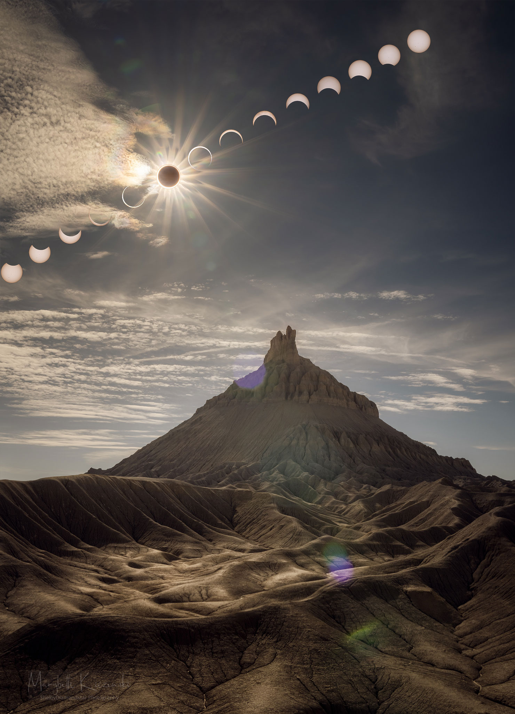
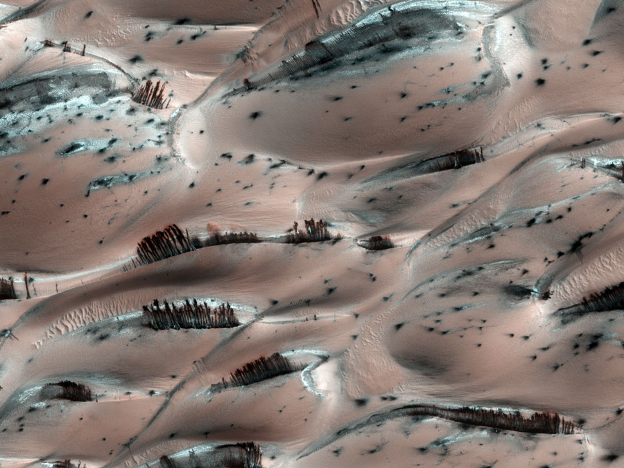
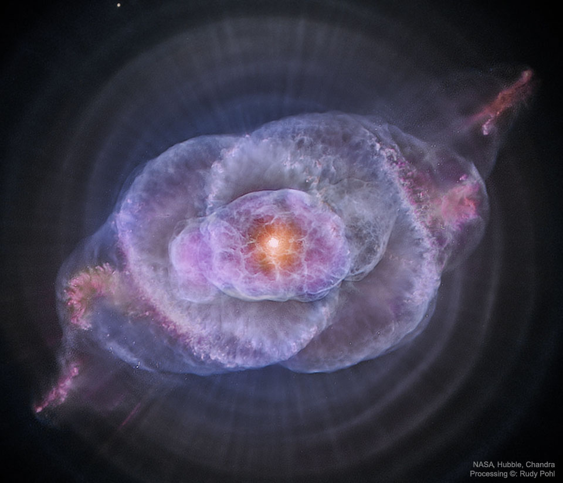

<style>
  body {
    background-color: black;
    color: white;
  }
  a {
    color: #00ffff;
  }
  h1, h2, h3, h4, h5, h6 {
    color: #ffd700;
  }
  .wrap {
    word-wrap: break-word;
    overflow-wrap: break-word;
    white-space: normal;
  }

  .nav-button {
    display: inline-block;
    padding: 12px 20px;
    margin: 6px;
    background: linear-gradient(135deg, red, orange, yellow, green, blue, indigo, violet);
    color: white;
    font-weight: bold;
    text-decoration: none;
    border-radius: 10px;
    box-shadow: 0 0 12px rgba(255, 255, 255, 0.3);
    font-size: 1rem;
    transition: all 0.3s ease;
  }
  .nav-button:hover {
    background: linear-gradient(135deg, violet, indigo, blue, green, yellow, orange, red);
    box-shadow: 0 0 15px #00ffff;
  }
</style>

# 🚀 NASA APIs Showcase (Live Data!)

Explore the wonders of our universe with this interactive web dashboard, powered by **[NASA’s open APIs](https://api.nasa.gov/)**. Instantly access space photos, sounds, Mars Rover images, ISS tracking, asteroid data, solar activity, videos, breaking news, and more—all in your browser!

> **Live Demo:**  
> [Visit the App](./index.html) &nbsp;|&nbsp; [NASA API Portal](https://api.nasa.gov/)

---

## 🌟 Features

- 🖼️ **Space Image Slideshow:** APOD slideshow refreshes every 10 seconds with new visuals.
- 🔀 **Random NASA Image:** One-click inspiration from the NASA archive.
- 📷 **Astronomy Picture of the Day (APOD):** Today’s image, metadata, and credit.
- 🚙 **Mars Rover Gallery:** Random Mars images from Perseverance + animated rover views.
- 🌍 **EPIC Earth Photos:** Latest full-disc imagery of Earth from DSCOVR.
- 🛰️ **Earth Satellite Shots:** Random real-time Earth images by date and location.
- ☄️ **Asteroid Data:** Closest-approaching asteroid for today.
- 🌞 **Solar Alerts:** Space weather updates including solar flares, CMEs, and warnings.
- 🛰️ **ISS Tracker:** Live location of the International Space Station.
- 👨‍🚀 **Astronauts in Space:** Who’s in orbit — real-time data.
- 🧠 **NASA Tech Patents:** Random NASA innovations & tech transfer ideas.
- 📰 **Breaking News Feed:** RSS-powered space mission headlines.
- 🎥 **Space Videos:** Random videos from NASA’s video library.
- 🔊 **NASA Audio Library:**
  - Classic soundboard including rockets, countdowns, and mission control.
  - Apollo 11: Daily audio archive with transcript download.
- 🌡️ **Mars Weather:** InSight’s latest report from the Red Planet.
- 💥 **Solar Eruptions (CMEs):** Latest recorded coronal mass events.
- 🕒 **Time-lapse Animations:** Mars gallery loops, EPIC Earth fade-in, and more.

---


## 💡 How It Works

- All dynamic content is powered by real-time JavaScript fetch calls to the NASA API and other public space data APIs.
- Each visual card represents a distinct API module.
- The UI is designed to be fast, animated, and mobile-friendly.
- Custom scripts include:
  - Navigation loading
  - Slideshow animations
  - Card-specific fetch and update logic

---

## 🌐 APIs Used

- **NASA APOD:** Astronomy Picture of the Day  
- **NASA Mars Rover Photos:** Perseverance daily imagery  
- **NASA EPIC:** Full Earth visuals  
- **NASA TechTransfer:** Inventions and patents  
- **NASA DONKI:** Space weather and alerts  
- **NASA RSS Feeds:** News and press updates  
- **Open Notify:** ISS position and astronauts  
- **NASA Image & Video Library**  
- **MAAS2:** Mars Weather  
- **NASA Audio Library**

---






---

## 🎨 Customization

- 🎨 **Style Tweaks:** Edit `styles.css` for fonts, colors, layout, and animations.  
- 🧩 **Add/Remove Cards:** Duplicate or delete any `<div class="api-card">` block.  
- 🔑 **Change API Key:** Update `nasaApiKey` in your JavaScript file.

---

## 🛡️ License

**MIT License**  
All NASA data, imagery, and media are in the public domain per [NASA’s media usage policy](https://www.nasa.gov/multimedia/guidelines/index.html).

---

## 🙏 Credits & Acknowledgments

- **Lead Developer & Designer:** DeJahn Lamar Bell / [Food4Thoth](https://www.food4thoth.com)  
- **APIs & Media:** [NASA Open APIs](https://api.nasa.gov)  
- **Inspiration:** NASA, CodePen dashboards, and the cosmic coding community

---

## 🤝 Contributing

1. Fork this repo  
2. Create a new branch  
3. Add a feature or fix  
4. Submit a pull request  

✨ Help expand this cosmic portal — new modules always welcome!

---

## 🚀 Explore More

- [NASA API Portal](https://api.nasa.gov)  
- [EPIC Camera Archive](https://epic.gsfc.nasa.gov)  
- [NASA Tech Transfer](https://technology.nasa.gov)  
- [Food4Thoth Portal](https://www.food4thoth.com)

---

## 🌌 Philosophy and Vision

Food4Thoth is inspired by the principles of its namesake, Thoth:
- **Creativity**: A celebration of art, imagination, and innovation.
- **Exploration**: Encouraging curiosity and the pursuit of knowledge.
- **Community Building**: Connecting individuals through shared resources and mutual support.
- **Playfulness**: Balancing deep inquiry with interactive and fun experiences.

The platform is a digital garden where ancient wisdom meets modern innovation.

---

## ✨ Why Visit Food4Thoth?

1. **Diverse Offerings**: Content that caters to various interests, from art and mysticism to community activism.
2. **Interactive Tools**: Explore engaging applications like calculators, games, and divination apps.
3. **Community Engagement**: Opportunities for collaboration and connection through artistic and social projects.
4. **Inspiration**: A space to spark curiosity, reflection, and joy.

---

## 🤝 Support and Contributions

Your contributions help support innovative projects like the Rainbow Glo-Calculato, community gardens, and esoteric tools, ensuring **Food4Thoth** continues to thrive.

### Donation Options

#### Traditional Payments:
1. [PayPal](https://paypal.me/artabillies)
2. [Venmo](https://venmo.com/u/DeJahnvu)

#### Cryptocurrency:
- **Ethereum (ETH) & ERC-20 Tokens**:  
  <div class="wrap">0x900e8f0d397048fD946b05553DeD5Ed3D5e4f1a0</div>  
  

- **Bitcoin (BTC)**:  
  <div class="wrap">bc1qcsa7ffef296pp9hkrn03p9wu7lt0fm3s2sz0wp</div>  
  

- **Ethereum Classic (ETC)**:  
  <div class="wrap">0xEb3C0e08868ACB0f515442579333c41E7a34F215</div>

- **Solana (SOL)**:  
   <div class="wrap">B7nCFQs6HkFAvkz1wEUiPpM4Cj7G6FJNYQ7Avrt6a4cm</div> 
  

- **Ripple (XRP)**:  
  Address:  <div class="wrap">rEAKseZ7yNgaDuxH74PkqB12cVWohpi7R6</div> 
  Memo: `3109966062`  
  

- **Dogecoin (DOGE)**:  
  <div class="wrap">DP2e6J8NbUzswLtBw8ou2xYz4BinyzgU7n</div>  
  

- **Cardano (ADA)**:  
  <div class="wrap">addr1qxqgjp4h4vh4pxrg7jur8m96lzf5w98cahfflrw376qhufgg6h5us0avc20ee2azzun58lgylyl54sjr6y9efwq86krs3ladtw</div>  
  

- **Bitcoin Cash (BCH)**:  
   <div class="wrap">bitcoincash:qpu93py8j8ykcf7m6tmau2hldefl67t9lydw8afsa5</div> 
 

- **Stellar Lumens (XLM)**:  
  Address:  <div class="wrap">GB2ES2N326MZK4EGJBKN3ZARCQ5RTFQSAWIJAAKFVIIIJSCC35TXIMLB</div>
  Memo: `2967141893`  
 

- **Litecoin (LTC)**:  
   <div class="wrap">ltc1qklestxa5shsym0gmuqmv2xewp56cst58vmhggl</div>

- **Tezos (XTZ)**:  
   <div class="wrap">tz1guFykj1dQAyiGH7g5YJVZzaGdoTWeMK81</div>  
 

---

## 💡 Wallets
1. **Coinbase Wallet**:  
  <div class="wrap">0x30D47A5815D94040291a819B8E39765AA09d44A8</div> 
   

2. **Metamask Wallet**:  
   <div class="wrap">0x30D47A5815D94040291a819B8E39765AA09d44A8</div>

3. **VeWorld Wallet**:  
    <div class="wrap">0x020a79559990145e2f7d48c5771b233399b30bee</div> 
   

4. **Anchor Wallet**:  
   `artabilly.gm`

---

## 🤝 Contribution Guidelines

We welcome contributions to enhance this project:
1. Fork the repository.
2. Create a feature branch: `git checkout -b feature-name`.
3. Commit your changes: `git commit -m "Add feature or fix"`.
4. Push your branch: `git push origin feature-name`.
5. Submit a pull request for review.

---

## 🔗 Explore the Food4Thoth Hub

Visit the **Food4Thoth** portal and begin your journey through creativity, mysticism, and connection.

- 🌟 [FOOD4THOTH Website](../index.html)
- 🌟 [FOOD4THOTH Instagram](https://www.instagram.com/emerald_path_food4th0th/profilecard/?igsh=dTJnejRlczhqNjho)
- 🌟 [FOOD4THOTH Facebook](https://www.facebook.com/share/W8VnfAM2NHBAMTUb/?mibextid=JRoKGi)
- 🌟 [Learn About ARTABILLIES](../Artabillies/index.html)
- 🌟 [ARTABILLIES Website](http://www.artabillies.com)
- 🌟 [ARTABILLIES Instagram](https://www.instagram.com/artabillies/profilecard/?igsh=MW1zbGg2Y2Z1a3FhdQ==)
- 🌟 [ARTABILLIES Facebook](https://www.facebook.com/share/sEUxePbaAo9kyRNN/?mibextid=JRoKGi)
- 🌟 [ARTABILLIES Facebook Group](https://www.facebook.com/share/g/6N5MX3W8pS3dbQuD/?mibextid=K35XfP)
- 🌟 [Rstory, FOOD4THOTH & ARTABILLIES](../RstoryArtabillies/index.html)
- 🌟 [Donations Page](../Donations/index.html)

---

## 📬 Contact & Support

- 🌐 [Food4Thoth Website](https://www.food4thoth.com)  
- 💬 [Artabillies Facebook Group](https://www.facebook.com/groups/food4thoth)  
- 📧 [Contact DeJahn](https://www.food4thoth.com/contact.html)  
- 🧪 [Explore More Projects](https://www.food4thoth.com/index.html)

### For inquiries or feedback:
- **Email**: [food4thoth@proton.me](mailto:food4thoth@proton.me)

---

## 🎉 Expore all our creations!

Food4Thoth represents the collective effort of artists, mystics, and community builders. Thank you to all contributors and supporters who make this digital garden flourish.

Join us and see the endless possibilities of **Food4Thoth**!

---

<style>
  .wrap {
    word-wrap: break-word;
    overflow-wrap: break-word;
    white-space: normal;
  }
</style>

## 📦 File Structure

```txt
/
├── index.html          # Main NASA Showcase HTML
├── styles.css          # Custom styles
├── nav-fetch.js        # Navigation fetch logic
├── nav_script2.js      # Navigation UI script
├── /images/            # Local images and icons
├── README.md           # This file!